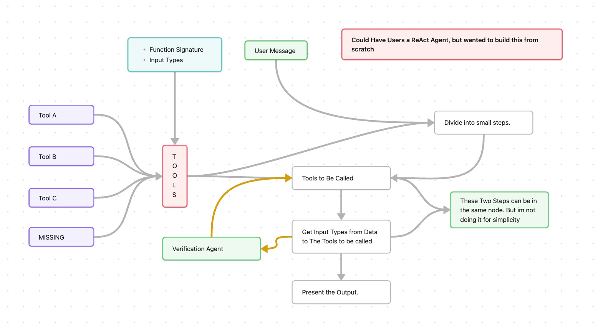
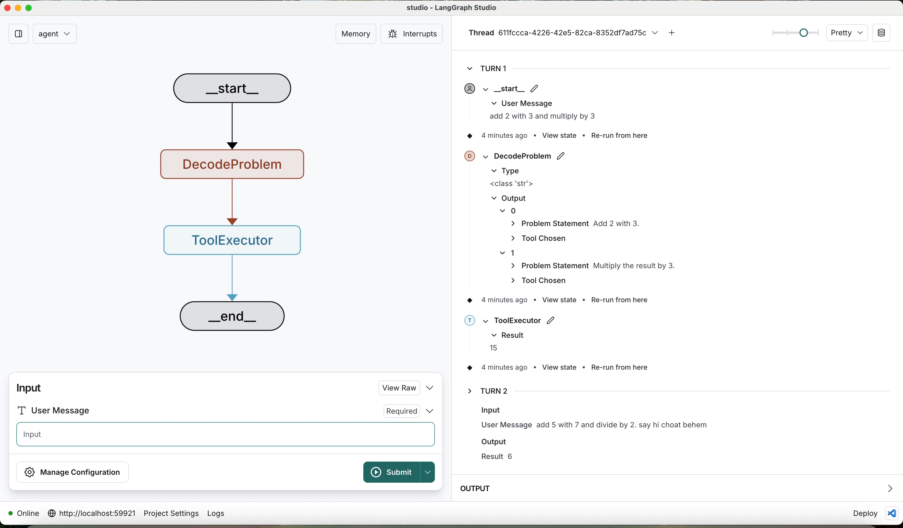

# 🧮 Auto Tool Picker and Executor




A structured, modular math problem solver built using [BAML](https://docs.boundaryml.com/home) and `langgraph`. This system takes a natural language math query and breaks it down into smaller solvable steps, choosing the appropriate tool (Add, Subtract, Multiply, Divide), executing the operations in sequence, and returning the final result. If the system encounters an unsupported instruction, it gracefully falls back to a `MISSING` tool.

---

## 🔧 Features

* ✅ Breaks complex arithmetic expressions into smaller problems
* ✅ Dynamically chooses tools using BAML classes (`Add`, `Subtract`, `Multiply`, `Divide`)
* ✅ Supports tool chaining with `previous_output` for sequential calculations
* ✅ Handles unrecognized instructions using a fallback `MISSING` tool
* ✅ Built on top of LangGraph and BAML for flexible AI workflow execution

---

## 📦 Tech Stack

* **BAML** – Structured prompt engineering
* **LangGraph** – State machine for multi-step AI workflows
* **Python (TypedDict & Pydantic)** – Type-safe structure
* **Custom GPT-4o** – For intelligent task decomposition and tool matching

---

## 📁 Project Structure

```text
.
├── tools/
│   └── tools.py          # Actual function definitions for add, subtract, etc.
├── studio.py             # Main graph pipeline logic
├── main.baml             # Tool definitions and orchestration logic
├── README.md             # You are here
```

---

## 🧠 How It Works

### 1. **Problem Breakdown**

```baml
function BreakProblemsAndFindTools(user_message: string) -> SmallerProblems[]
```

* Breaks down the user’s natural language request into smaller sequential steps.
* Chooses the right BAML tool or assigns `MISSING` if it cannot decide.

---

### 2. **Tools Defined (BAML)**

```baml
class Add {
  tool_name "add_2_numbers"
  ...
}
```

Each tool (Add, Subtract, Multiply, Divide) takes two float inputs. The first can optionally be the `"previous_output"` from a prior step.

---



### 3. **Execution Pipeline**

`studio.py` builds a LangGraph-based state machine:

* `ProblemDivider`: Invokes `BreakProblemsAndFindTools`
* `FunctionExecutor`: Iterates through the returned subproblems, applying the appropriate Python functions from `tools/tools.py`

---

## 🧪 Example Test Case

**Input:**

```text
"Add 5 with 2.5 and 3.2 and divide it by 4. And say chotabheem"
```

**Output (after problem breakdown):**

```json
[
  { "problem_statement": "Add 5 with 2.5.", "tool_chosen": "ADD_TWO_NUMBERS" },
  { "problem_statement": "Add the result with 3.2.", "tool_chosen": "ADD_TWO_NUMBERS" },
  { "problem_statement": "Divide the result by 4.", "tool_chosen": "DIVIDE_TWO_NUMBERS" },
  { "problem_statement": "Say 'chotabheem'.", "tool_chosen": "MISSING" }
]
```

---

## 🚀 Running the Project

1. Install dependencies:

   ```bash
   pip install langgraph pydantic baml_client typing_extensions
   ```

2. Set up your BAML API key if required.

3. Run `studio.py`:

   ```bash
   python studio.py
   ```

---

## 📜 License

MIT License. Use freely with attribution.